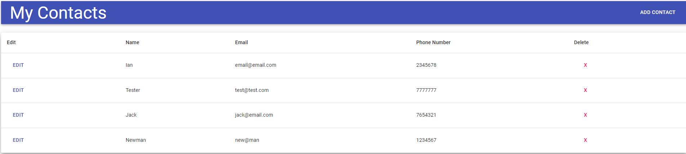

# CRS-Consulting-Assessment

Using Material UI version 1 and React create-react-app, create a Contacts App where you can read, add, edit or delete contacts. It can be a simple list with buttons to add, edit, delete each contact. The contact fields are name, phone, email.



## Getting Started

This application is already deployed, however these instructions will get you a copy of the project up and running on your local machine for development and testing purposes.

### Prerequisites

Node.js is required.

### Installing

To install the necessary dependencies, run the npm installation command

```
npm install
```

### Testing

There are no tests in this application.

### Usage

You can run the program on the command line with the following command:

```
npm start
```

## Built With

- [CSS](https://developer.mozilla.org/en-US/docs/Web/CSS)
- [Material UI](https://mui.com/)
- [Javascript](https://developer.mozilla.org/en-US/docs/Web/JavaScript)
- [Node.js](https://nodejs.org/en/docs/)
- [Express](https://expressjs.com/)
- [React](https://reactjs.org/)

## Deployed Link

- [See Live Site](https://acedyu.github.io/crs-assessment/)

## Authors

AcedYu

- [Link to Github](https://github.com/AcedYu)
- [Link to LinkedIn](https://www.linkedin.com/in/alex-yu-3712811b9/)
